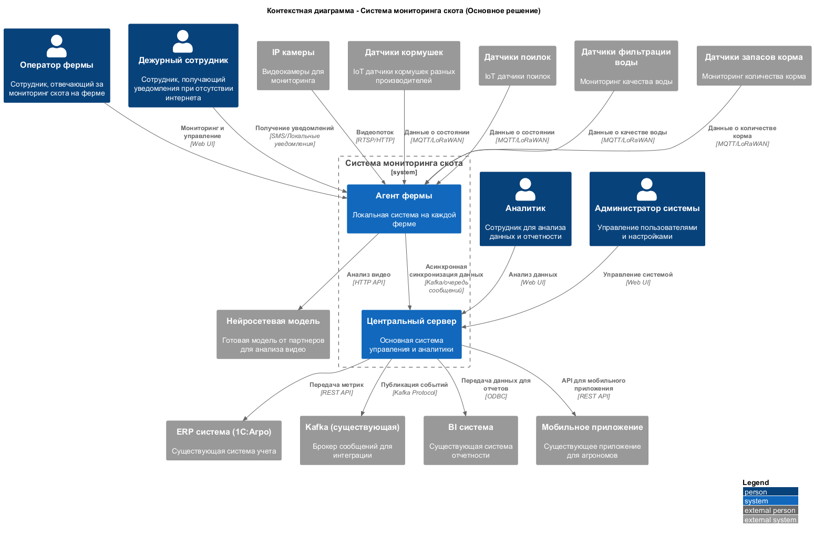

### **Название задачи:** 
Разработка MVP системы мониторинга скота для компании «АгроТех Х»

### **Автор:**
Архитектурная команда

### **Дата:**
2024

### **Проблема и контекст**
Компания «АгроТех Х» имеет 150 тепличных комплексов и занимается свиноводством. Существующий IT-ландшафт включает современные и устаревшие технологии. Компания внедрила мониторинг техники, но сейчас стоит задача повысить эффективность в сфере животноводства и автоматизировать процессы кормления, безопасности и мониторинга поголовья.

Существующие решения на рынке (PigVision, ALUS, PigTales) не подходят из-за законодательных ограничений или высокой стоимости. Требуется создать MVP с нуля, который в будущем может стать SaaS-решением.

### **Функциональные требования**

|**№**|**Действующие лица или системы**|**Use Case**|**Описание**|
| :-: | :- | :- | :- |
|1|Система видеоаналитики|Фиксация беспокойного поведения|Автоматическое обнаружение драк и беспокойства среди животных с оповещением оператора|
|2|Система видеоаналитики|Фиксация задавливания поросят|Обнаружение случаев задавливания поросят взрослыми особями|
|3|Система управления|Управление кормушками и поилками|Интеграция с оборудованием разных производителей для автоматического управления|
|4|Система видеоаналитики|Оценка состояния животных|Анализ внешнего вида и поведения для выявления болезней, гибели, беспокойства|
|5|IoT система|Мониторинг фильтрации воды|Отслеживание состояния систем фильтрации воды|
|6|Система подсчета|Пересчет поголовья|Автоматический подсчет количества животных|
|7|Система планирования|Прогнозирование расхода корма|Мониторинг запасов и прогнозирование потребности в корме|
|8|Система видеоаналитики|Поддержка множественных камер|Интеграция с камерами разных производителей для аналитики в реальном времени|
|9|Агентская система|Работа без интернета|Функционирование при отсутствии связи с локальными уведомлениями|
|10|Система безопасности|Аутентификация и авторизация|Разделение ролей с современными методами безопасности|
|11|API система|Интеграция с внешними системами|Предоставление API для мобильных и веб-приложений|

### **Нефункциональные требования**

|**№**|**Требование**|
| :-: | :- |
|1|Отказоустойчивость 99,95%|
|2|Расширяемость системы без изменения существующего функционала|
|3|Высокая производительность: оповещение за 5 секунд после обнаружения нештатной ситуации|
|4|Реакция видеоаналитики в реальном времени (миллисекунды)|
|5|Синхронизация между агентами и центральным сервером с задержкой до 10 минут|
|6|Работа в условиях нестабильного WiFi на фермах|
|7|Покрытие камерами всей площади без слепых зон|

### **Решение**

#### Основное решение: Агентская архитектура

**Контекстная диаграмма основного решения:**

**Обоснование выбора технологий:**

1. **Агентская архитектура** - обеспечивает работу при отсутствии интернета и снижает зависимость от сетевой инфраструктуры
2. **Интеграция с существующими системами** - использование Kafka для событийной архитектуры и REST API для синхронного взаимодействия
3. **Готовая нейросетевая модель** - снижает время разработки и риски
4. **MQTT/LoRaWAN** - для IoT устройств, обеспечивает надежную передачу данных в условиях нестабильной связи
5. **Web UI** - для операторов ферм, обеспечивает простоту использования

#### Альтернативное решение: Edge-вычислительная архитектура

**Контекстная диаграмма альтернативного решения:**

**Обоснование альтернативного решения:**

1. **Edge-вычислитель** - более мощная локальная обработка данных
2. **Локальная база данных** - полное хранение данных на ферме
3. **Batch-синхронизация** - снижение нагрузки на сеть
4. **Более сложная архитектура** - требует больше ресурсов на ферме

### **Альтернативы**

**Основное решение (Агентская архитектура):**
- **Преимущества:** Простота развертывания, низкие требования к ресурсам, быстрая разработка MVP
- **Недостатки:** Ограниченная локальная обработка, зависимость от центрального сервера для сложной аналитики

**Альтернативное решение (Edge-вычислительная архитектура):**
- **Преимущества:** Мощная локальная обработка, независимость от центрального сервера, возможность сложной аналитики на месте
- **Недостатки:** Высокая стоимость развертывания, сложность обслуживания, избыточность для MVP

**Недостатки, ограничения, риски**

**Технические риски:**
1. **Качество нейросетевой модели** - готовые модели могут не подходить для специфических условий ферм
2. **Проблемы с освещением** - ночная съемка требует специального оборудования
3. **Трекинг животных** - сложность идентификации похожих особей
4. **Нестабильный WiFi** - требует резервных каналов связи

**Архитектурные риски:**
1. **Масштабируемость** - при росте количества ферм может потребоваться пересмотр архитектуры
2. **Интеграция с существующими системами** - сложность интеграции с устаревшими компонентами
3. **Безопасность** - риски при работе с персональными данными и критически важными системами

**Бизнес-риски:**
1. **Стоимость развертывания** - высокая стоимость оборудования для каждой фермы
2. **Обучение персонала** - необходимость обучения операторов работе с новой системой
3. **Регулятивные требования** - возможные изменения в законодательстве по работе с животными

**Компромиссы:**
1. **Выбор основного решения** - компромисс между функциональностью и стоимостью для MVP
2. **Задержка синхронизации** - компромисс между актуальностью данных и стабильностью работы
3. **Использование готовой нейросети** - компромисс между качеством и скоростью разработки 