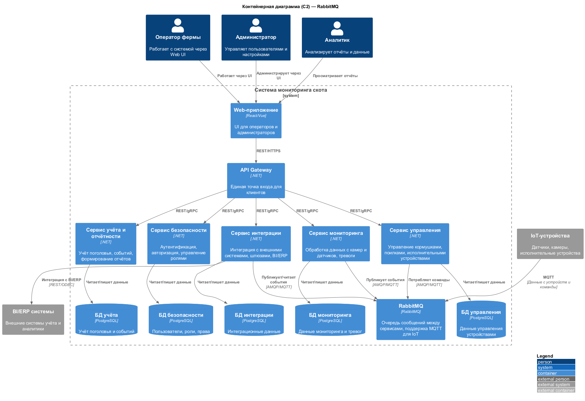
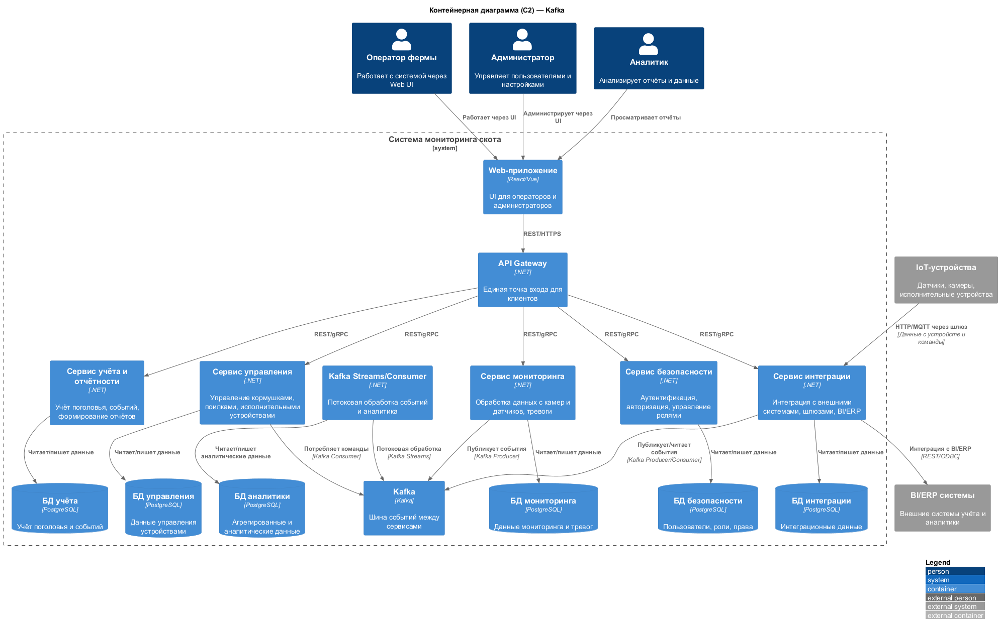

### Название задачи
Проектирование микросервисной архитектуры для системы мониторинга скота (этап 2)

### Автор
Архитектурная команда

### Дата
2024

### Ограниченные контексты (Bounded Contexts)
Определены следующие ограниченные контексты для проектирования микросервисов:

| № | Контекст                | Описание |
|:-:|-------------------------|----------|
| 1 | Контекст мониторинга    | Сбор и анализ данных с камер, датчиков, видеоаналитика, тревоги |
| 2 | Контекст управления     | Управление кормушками, поилками, исполнительными устройствами |
| 3 | Контекст учёта и отчётности | Учёт поголовья, событий, формирование отчётов, интеграция с BI/ERP |
| 4 | Контекст интеграции     | Интеграция с внешними системами, шлюзами, очередями сообщений |
| 5 | Контекст безопасности   | Аутентификация, авторизация, управление ролями |

### Варианты архитектурных решений (диаграммы контейнеров)

#### Вариант 1: RabbitMQ как основная очередь сообщений
- Используется RabbitMQ для обмена сообщениями между сервисами и интеграции с IoT-устройствами (через MQTT).

#### Вариант 2: Kafka как основная очередь сообщений
- Используется Kafka для событийной интеграции между сервисами и потоковой обработки данных.

### Интеграции между сервисами и обоснование выбора технологий

#### Вариант 1 (RabbitMQ)
- **Преимущества:**
  - Возможность использовать MQTT для взаимодействия с IoT-устройствами
  - Распространённая технология, не требовательна к ресурсам
  - Поддаётся кластеризации
- **Ограничения:**
  - При высоких нагрузках может потребоваться переход на Kafka
  - Менее удобна для потоковой аналитики

#### Вариант 2 (Kafka)
- **Преимущества:**
  - Высокая производительность и масштабируемость
  - Поддержка потоковой обработки данных (stream processing)
  - Хорошо подходит для событийно-ориентированной архитектуры
- **Ограничения:**
  - Более сложная эксплуатация и настройка
  - Требует больше ресурсов
  - Не поддерживает MQTT "из коробки"

### Компромиссы и риски

| Вариант | Компромиссы | Риски |
|---------|-------------|-------|
| RabbitMQ | Простота и универсальность, но ограничение по масштабируемости и аналитике | Возможные задержки при больших объёмах данных, сложность миграции на Kafka |
| Kafka    | Масштабируемость и потоковая аналитика, но сложность эксплуатации и интеграции с IoT | Повышенные требования к инфраструктуре, сложность поддержки, отсутствие MQTT |

**Обоснование выбора единого стека C# (.NET):**
- Использование одного языка программирования для всех микросервисов существенно упрощает сопровождение, развитие и поддержку системы.
- Единый стек снижает требования к компетенциям команды, ускоряет обучение новых сотрудников, облегчает автоматизацию CI/CD, мониторинг и эксплуатацию.
- Применение разных языков и технологий в рамках одной системы приводит к усложнению инфраструктуры, увеличению затрат на поддержку, росту числа ошибок интеграции и снижению скорости внедрения изменений.
- Поэтому для данного проекта выбран единый стек C# (.NET) для всех микросервисов как наиболее рациональный и управляемый подход.

**Почему C# (.NET) — подходящий выбор для данной системы:**
- Современный .NET Core кроссплатформенный, поддерживает Linux и Windows, легко контейнеризуется (Docker, Kubernetes).
- Предоставляет хорошую поддержку микросервисной архитектуры: REST/gRPC, очереди сообщений (RabbitMQ, Kafka), работа с БД, интеграция с IoT (MQTT, AMQP).
- Имеет развитую экосистему библиотек и инструментов для корпоративных, промышленных и IoT-решений.
- Обеспечивает достаточную производительность и масштабируемость, зрелые средства мониторинга и автоматизации.
- Позволяет интегрироваться с BI/ERP и корпоративными системами.
- На рынке достаточно специалистов, платформа активно развивается и поддерживается сообществом.
- Позволяет реализовать все необходимые сервисы (мониторинг, управление, интеграция, безопасность, отчётность) в едином технологическом стеке.

**Архитектурное решение по хранению данных:**
- В соответствии с принципами микросервисной архитектуры, каждый сервис владеет своей собственной базой данных (или схемой). Это обеспечивает слабую связанность, независимость развертывания и масштабирования, а также изоляцию данных.
- Такой подход упрощает сопровождение, позволяет изменять схему данных и масштабировать сервисы независимо друг от друга, снижает риски конфликтов и ошибок интеграции.
- Для MVP допускается использование отдельных схем в одной СУБД, но для промышленной эксплуатации рекомендуется физическое разделение БД.

### Паттерны и способы взаимодействия между микросервисами

**Характер взаимодействия:**
- В системе используются оба паттерна: «точка-точка» (point-to-point) и «публикация-подписка» (pub/sub).
- 
  - **Точка-точка** применяется для команд и запросов, когда сообщение или команда адресованы конкретному сервису (например, команда управления устройством от сервиса управления к исполнительному устройству через очередь).
  - **Публикация-подписка** используется для событий, которые могут быть интересны нескольким сервисам (например, событие о тревоге публикуется сервисом мониторинга и может быть обработано сервисом учёта, интеграционным сервисом и др.).

**Способ взаимодействия:**
- 
  - **Синхронное взаимодействие** реализовано через REST/gRPC между API Gateway и микросервисами. Клиент получает ответ в рамках одного сетевого подключения. Применяется для операций, где важна немедленная реакция (например, запрос состояния, получение отчёта, управление пользователями).
  - **Асинхронное взаимодействие** реализовано через очереди сообщений (RabbitMQ или Kafka). Сервис-отправитель публикует событие или команду, а получатель обрабатывает её независимо, возможно с задержкой. Применяется для событий, команд управления устройствами, интеграции с IoT, уведомлений.

**Примеры для данной архитектуры:**
- Сервис мониторинга публикует событие тревоги в очередь (pub/sub), которое может быть обработано сервисом учёта и интеграционным сервисом.
- Сервис управления отправляет команду конкретному устройству через очередь (point-to-point).
- API Gateway вызывает сервис учёта по REST для получения отчёта (синхронно).
- IoT-устройства отправляют данные через MQTT (асинхронно) в очередь сообщений.

**Выбор конкретного паттерна и способа взаимодействия зависит от бизнес-логики и требований к скорости реакции, надёжности и масштабируемости.** 

## Выбор технологии очереди сообщений

Для MVP и пилотного внедрения системы мониторинга выбран RabbitMQ как основная очередь сообщений. Это решение обусловлено следующими причинами:
- RabbitMQ обеспечивает необходимую надёжность, простоту эксплуатации и интеграцию с IoT (через MQTT) для ограниченного количества ферм и агентов.
- Ожидаемая нагрузка на этапе MVP и начального масштабирования не превышает порог, при котором требуется использовать Kafka.
- RabbitMQ позволяет быстро развернуть и поддерживать систему, минимизируя инфраструктурные затраты.

**Переход на Kafka** может быть рассмотрен в будущем, если система будет масштабироваться до десятков тысяч сообщений в секунду, потребуется потоковая аналитика или появятся новые требования к отказоустойчивости и обработке больших объёмов данных.

**Итог:**
- Основная очередь сообщений: RabbitMQ
- Kafka не используется в текущей архитектуре, но может быть рассмотрена при существенном росте нагрузки. 

## SLA и требования к времени реакции
- Время реакции на критическую тревогу (Alarm): не более 5 секунд от момента возникновения события до оповещения оператора.
- Время доставки сообщения между сервисами RabbitMQ: не более 1 секунды для 99% сообщений.
- Время синхронизации между агентом и центральным сервером: не более 10 минут при восстановлении связи.

## Мониторинг и алертинг инфраструктуры
- Для RabbitMQ, БД и всех микросервисов настраивается мониторинг (Prometheus, Grafana, встроенные метрики RabbitMQ).
- Критерии алертов: переполнение очереди, задержки доставки сообщений, отказ сервисов, превышение времени ответа API, ошибки подключения к БД.
- Используется dead-letter queue для сообщений, которые не удалось обработать после нескольких попыток.

## Обработка ошибок и отказоустойчивость
- Все сервисы реализуют обработку ошибок с ретраями (повторными попытками) и логированием неудачных операций.
- Для критических ошибок используется dead-letter queue и уведомление операторов.
- При отказе RabbitMQ или БД сервисы переходят в режим деградации (ограниченная функциональность, локальное хранение событий до восстановления связи).

## Безопасность
- Все взаимодействия между сервисами и очередями RabbitMQ защищены TLS.
- Аутентификация и авторизация пользователей и сервисов реализована через отдельный сервис безопасности (JWT, OAuth2).
- Данные в БД шифруются на уровне хранения (at rest) и передачи (in transit).
- IoT-устройства аутентифицируются по сертификатам или токенам.

## Версионирование API
- Внешние и внутренние API версионируются (например, /api/v1/...), чтобы обеспечить обратную совместимость при развитии системы.
- Изменения в API документируются и тестируются на совместимость.

## Сценарии деградации и отказоустойчивость
- При потере связи между агентом и центральным сервером события и тревоги накапливаются локально и синхронизируются при восстановлении связи.
- При переполнении очереди RabbitMQ или отказе БД сервисы переходят в режим ограниченной функциональности, уведомляют операторов и сохраняют данные локально.
- Для всех критических компонентов предусмотрены резервные копии и автоматическое восстановление.

## Интеграция с BI/ERP
- Для интеграции с BI/ERP реализован отдельный сервис/класс IntegrationService, который агрегирует данные из БД и RabbitMQ и передаёт их во внешние системы через REST API или ODBC.
- Все интеграции логируются и мониторятся на предмет ошибок и задержек. 
